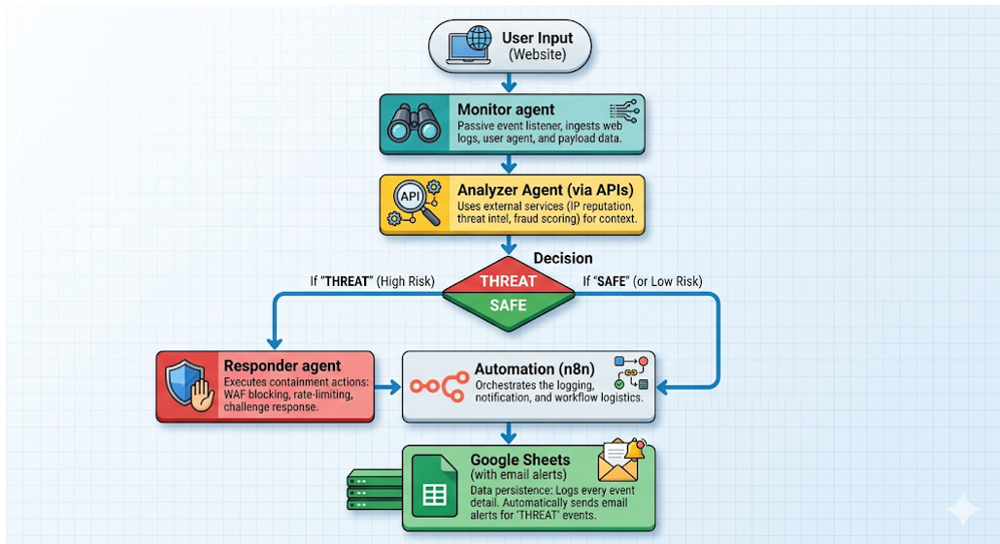
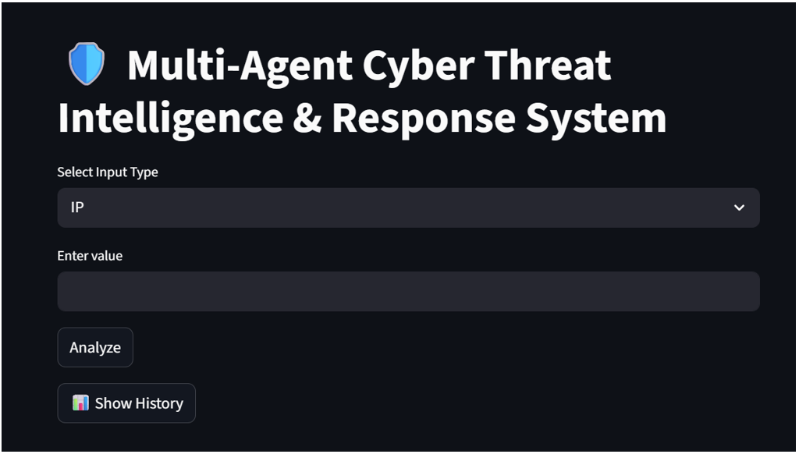
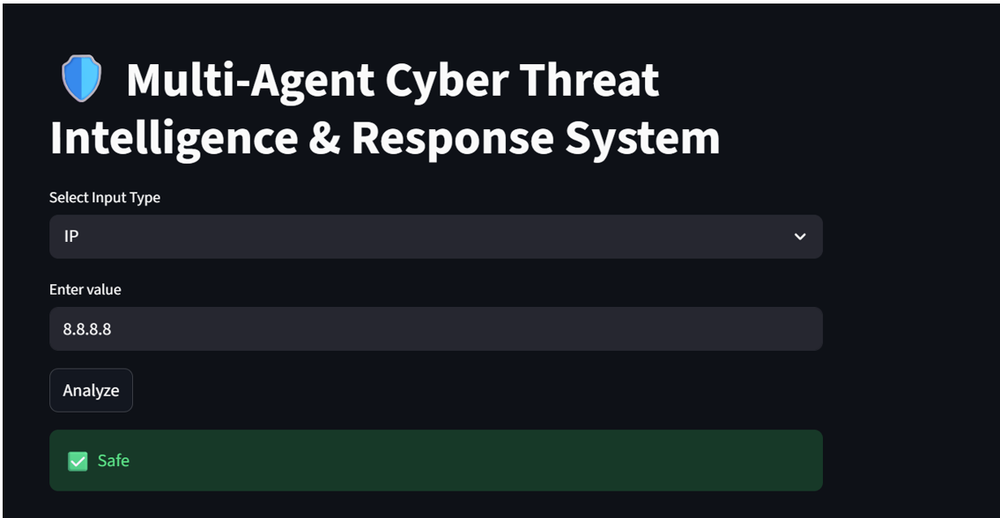
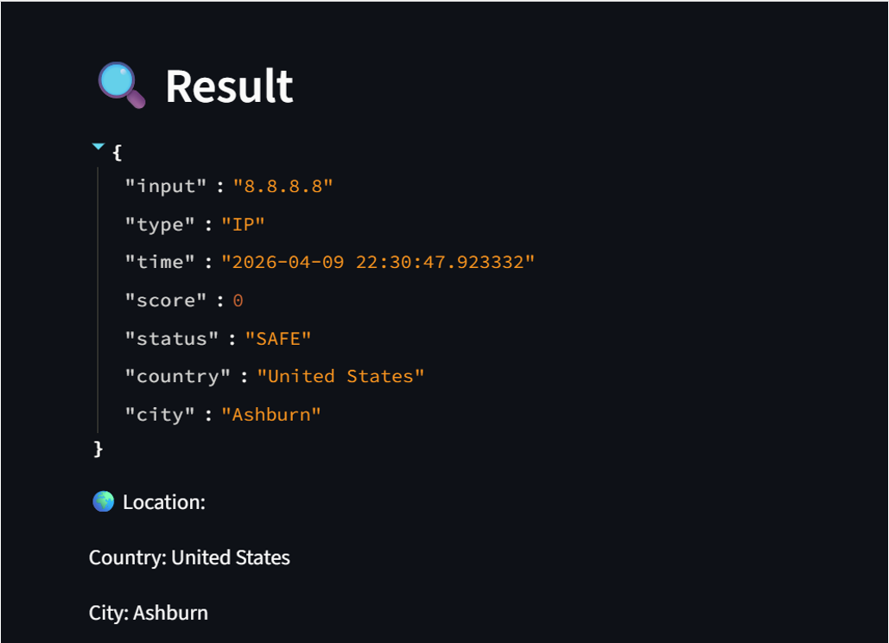
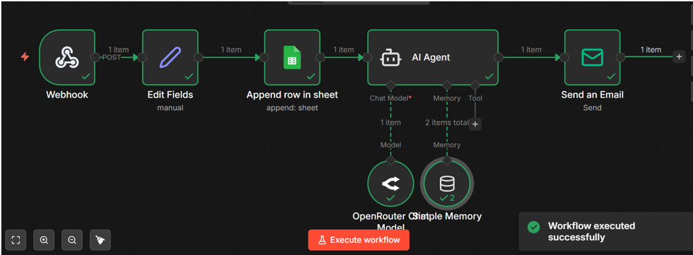
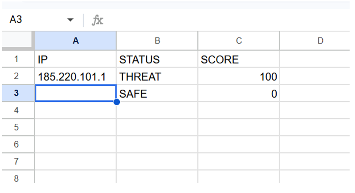

**🛡️ Multi-Agent Cyber Threat Intelligence & Response System**

An intelligent and automated cybersecurity solution powered by Agentic AI. This system integrates multiple agents, external APIs, and workflow automation tools to detect, analyze, and respond to cyber threats in real time while maintaining historical logs for analysis.

**1. 🔍 Business Problem**

Cybersecurity threats are rapidly increasing in today’s digital world. These threats include malicious IP addresses, phishing URLs, and harmful file hashes that can compromise systems and data. Traditional detection methods are mostly manual, time-consuming, and inefficient. Additionally, there is no centralized automated system that can quickly analyze threats, take action, and maintain logs for future reference. This delay in detection and response increases the risk of cyber attacks and system vulnerabilities.

**2. 💡 Possible Solution**

To address this problem, a smart and automated system is required that can:
Analyze different types of inputs such as IP addresses, URLs, and file hashes
Detect threats using external threat intelligence APIs
Automatically trigger alerts and workflows
Store logs for future analysis and auditing

Such a system should be fast, scalable, and capable of making decisions without human intervention.

**3. 🚀 Implemented Solution**

The proposed solution is a Multi-Agent Cyber Threat Intelligence System built using Agentic AI concepts.

The system consists of multiple specialized agents:

Monitoring Agent → Captures user input (IP/URL/HASH)
Analysis Agent → Evaluates threats using APIs (AbuseIPDB, VirusTotal)
Response Agent → Takes action and triggers workflows
Explanation Agent → Generates human-readable explanations
**🔄 Workflow:**
User enters input through the web interface
Monitoring Agent collects the input
Analysis Agent checks threat level using APIs
System classifies result as SAFE or THREAT
Response Agent triggers automation via n8n
Data is stored in Google Sheets
User can view results and search history

This system ensures real-time detection, automation, and logging.

**4. 🛠️ Tech Stack Used**

Component	            Technology

Backend Logic	Python

Frontend UI	            Streamlit

Workflow Automation	n8n

IP Analysis	AbuseIPDB    API

URL/Hash Analysis	VirusTotal API

Database/Logging	Google Sheets

Environment Config	python-dotenv

**5. 🧩 Architecture Diagram**

Architecture Flow:
User Input (Website)
        ↓
Monitoring Agent
        ↓
Analysis Agent (APIs)
        ↓
Decision (SAFE / THREAT)
        ↓
Response Agent
        ↓
n8n Workflow Automation
        ↓
Google Sheets + Email Alerts

**6. ▶️ How to Run Locally**

🔹 Step 1: Install Dependencies
pip install requests streamlit python-dotenv

🔹 Step 2: Create .env File
ABUSE_API_KEY=your_api_key
VT_API_KEY=your_api_key

🔹 Step 3: Start n8n
n8n start

🔹 Step 4: Run Application
python -m streamlit run app.py

🔹 Step 5: Open in Browser
http://localhost:8501

**7. 📚 References & Resources**
https://www.abuseipdb.com/
https://www.virustotal.com/
https://docs.n8n.io/
https://docs.streamlit.io/
**8. 🎥 Recording**

https://drive.google.com/file/d/1qiCh8StwE_Iy4Hj-fn5oayJXBWXuOkp2/view?usp=drivesdk

**9. 📸 Screenshots**
🌐 Website UI

🔗 n8n Workflow

📊 Google Sheets Output

**10. 📐 Formatting**
✔ Proper headings used
✔ Bullet points for readability
✔ Clean spacing and alignment
✔ Structured sections for clarity
**11. ⚠️ Problems Encountered and Solutions**

During the development of this project, several technical challenges were encountered and resolved effectively.

One of the major issues was handling API errors, as external services like AbuseIPDB and VirusTotal sometimes returned unexpected responses or failed requests. This was resolved by implementing robust error handling using try-except blocks, ensuring that the system continues to function smoothly even when API failures occur.

Another challenge was the Streamlit rerender behavior, where the entire UI reloads on every interaction. This caused input fields and buttons to reset frequently. To overcome this, Streamlit’s session_state was used to preserve UI state and maintain user interactions across reruns.

There was also an issue with data integration in n8n, where the system initially returned unstructured text instead of JSON. This caused mapping failures when sending data to Google Sheets. The issue was fixed by restructuring outputs into proper JSON format, enabling seamless workflow automation.

Additionally, the history feature initially relied on temporary memory, causing data loss after refresh. This was solved by implementing persistent storage using a local JSON file, allowing users to retrieve and filter past records efficiently.
